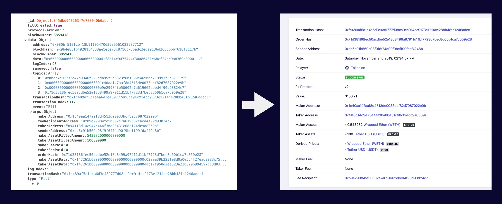

# Introduction

0x Tracker has been monitoring the [0x](https://0x.org/) since 2017. It provides access to trading information, visualizes trends, and aggregates ecosystem news. All of this data is made available through a public website at [0xtracker.com](https://0xtracker.com) and a [public API](api-reference/introduction.md).

The entire codebase was open sourced in late 2018 with the goals of: increasing transparency, enabling community contribution, and injecting additional value into the ecosystem. If you are interested in supporting the development of 0x Tracker then head over to the [developers page](contributing-1/developers.md) to find out more.

## How does it work?

Every time an exchange of assets occurs through 0x various events are emitted which get stored on the permanent ledger \(blockchain\). These events contain information about the trade such as: which assets were traded, who were the parties involved, what fees were charged, and which apps were responsible for facilitation.

0x Tracker has worker processes which continually fetch 0x events from the blockchain. These events are stored in a database and combined with information from other sources to provide the screens you find on 0xtracker.com.

The 0x Tracker platform itself is comprised of a number of different components to achieve the end result. The repositories for each of these components can be found on the 0x Tracker GitHub [organisation page](https://github.com/0xtracker).

## Need to get in touch?

For general enquiries the best way to get in touch is [hello@0xtracker.com](mailto:hello@0xtracker.com) or you can reach out to [@0xTracker](https://twitter.com/0xtracker) on Twitter. If you need to report a bug or request a feature then please refer to the [bugs & features page](contributing-1/bugs-and-features.md).

